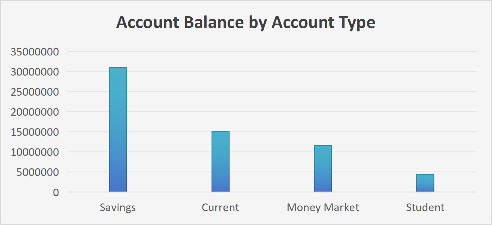
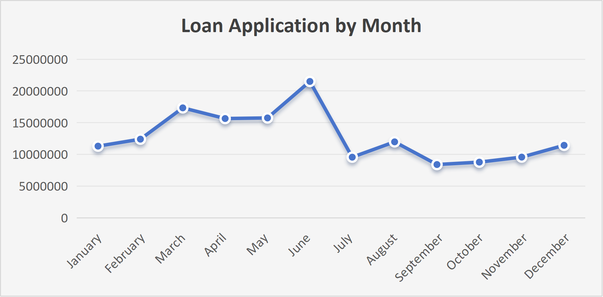

# Banking Customer and Financial Analysis

**SQL | Excel | Data Cleaning | Data Analysis | Business Reporting**

## Executive Summary

This project analyses customer banking activity, account balances, transactions and lending performance to identify business opportunities and potential financial risks.

The dataset contains **1,500 customers, 2,100 accounts, 15,000 transactions, 900 loans and 6,000 loan payments**. I cleaned the data by identifying and removing duplicate values before using SQL and Excel to analyse the data and build a dashboard.

The analysis highlights a strong deposit base, increasing use of digital banking, significant lending demand and a need for closer monitoring of loan repayment behaviour.

---

## Business Problem

The bank needs to understand how customers use its products and channels, where lending demand is strongest, and whether repayment behaviour creates potential risk.

The analysis therefore focused on customer deposits, transaction activity, lending performance and repayment patterns to identify where the bank could improve **customer value, operational efficiency and risk management**.

---

## Business Questions

- Where are customer deposits concentrated?
- Which banking channels are used most?
- Which loan products and periods show the strongest demand?
- What does repayment behaviour indicate about potential credit risk?
- Are there geographic patterns that could support more targeted strategies?

---

## Methodology

### Data Cleaning

I performed data-quality checks before analysis, including identifying and removing **duplicate values** to ensure the results were not distorted by repeated records.

### SQL Analysis

SQL was used to analyse customer, account, transaction, loan and loan-payment data using aggregations, grouping and segmentation to identify key business patterns.

### Excel Analysis and Dashboard

Excel was used to connect information across tables using **XLOOKUP**, allowing related customer, account, transaction and loan information to be brought together for analysis and visualisation.

I then used **pivot tables and charts** to build the final dashboard.

### Business Reporting

The findings were translated into business implications and recommendations rather than simply presenting the numbers.

---

## Key Findings and Business Actions

### Strong Deposits and Digital Banking



Customer accounts hold approximately **R62.3 million**, with savings accounts contributing around **R31.1 million (50%)**.

The Mobile App was also the strongest transaction channel, generating approximately **R6.6 million** in transaction value.

**Business action:**  
The bank could use its strong deposit base and digital channels to promote investment, savings and personalised products while shifting more routine activity towards lower-cost digital channels.

### Lending Demand



The bank processed **900 loan applications** worth approximately **R153.7 million**. Personal loans represented the largest lending category at approximately **R51.3 million**.

Loan demand also varied throughout the year, with June recording the highest monthly loan value at approximately **R21.5 million**.

**Business action:**  
The bank could use loan-type and seasonal demand patterns to improve lending campaigns and operational planning, while considering repayment performance before expanding lending.

### Repayment Risk

```sql
WITH LoanRisk AS
(
SELECT
    L.LoanType,
    COUNT(*) AS TotalPayments,
    SUM(
        CASE
            WHEN LP.PaymentStatus IN ('Late', 'Missed')
            THEN 1
            ELSE 0
        END
            ) AS RiskPayments
FROM Loans AS L
    JOIN LoanPayments AS LP
        ON L.LoanID = LP.LoanID
GROUP BY L.LoanType
)
SELECT
    LoanType,
    TotalPayments,
    RiskPayments,
    RiskPayments * 1.0 / TotalPayments * 100 AS RiskPercentage
FROM LoanRisk
ORDER BY RiskPercentage DESC;
```

Approximately **81.8% of payments were made on time**, while **13.6% were late and 4.7% were missed**.

This means approximately **18.2% of payments were not made on time**, creating a meaningful area for credit-risk monitoring.

**Business action:**  
Early-warning indicators, payment reminders and more targeted monitoring could help identify customers experiencing repayment difficulties sooner.

### Deposit and Lending Behaviour Differ Across Cities

Cape Town has the highest total account balance at approximately **R7.0 million**, followed by Pretoria and Mbombela at approximately R6.6 million each.

However, the cities with the highest loan demand are different.

Kimberley has the highest loan value at approximately **R18.4 million**, followed by Polokwane at approximately **R17.5 million** and East London at approximately **R17.4 million**.

**Business action:**

This suggests that the bank should avoid applying the same strategy across every geographic market.
For example:
- Higher-deposit markets could be targeted for savings, investment and premium products.
- Higher-loan-demand markets could receive more focused lending strategies.
- Lower-balance markets could be investigated further before being considered weaker markets.
This could help the bank allocate marketing and customer-engagement resources more effectively.

---

## Overall Business Priorities

The analysis suggests four main priorities:

1. **Increase customer value** through targeted savings, investment and banking products.
2. **Continue digital investment** and shift routine activity towards digital channels.
3. **Target lending more effectively** using loan demand and repayment performance.
4. **Strengthen repayment-risk monitoring** through earlier identification of potential payment difficulties.

---

## Limitations

The analysis is based on the available dataset and static Excel dashboard. It identifies patterns and relationships but does not establish causation.

The dashboard also does not provide interactive filtering for deeper customer-level investigation.

---

## Next Steps

Further analysis could investigate:

- Repayment risk by loan type and customer segment
- Customer profitability and lifetime value
- Digital adoption by customer segment
- Relationships between income, employment and repayment behaviour
- More detailed geographic lending and deposit patterns
- Create an interactive dashboard using Power BI

---

## Project Deliverables

- **SQL Analysis** — customer, account, transaction and lending analysis
- **Excel Dashboard** — XLOOKUP, pivot tables and visualisations
- **Business Report** — findings, implications and recommendations
- **Cleaned Dataset** — duplicate values identified and removed before analysis

---

## Dashboard Preview


---

## Final Takeaway

The analysis shows that the bank has strong opportunities in its **deposit base, digital banking activity and lending portfolio**, but growth needs to be balanced with stronger repayment-risk monitoring.

The project demonstrates how I used **data cleaning, SQL and Excel together** to move from raw banking data to business-focused insights and recommendations.
